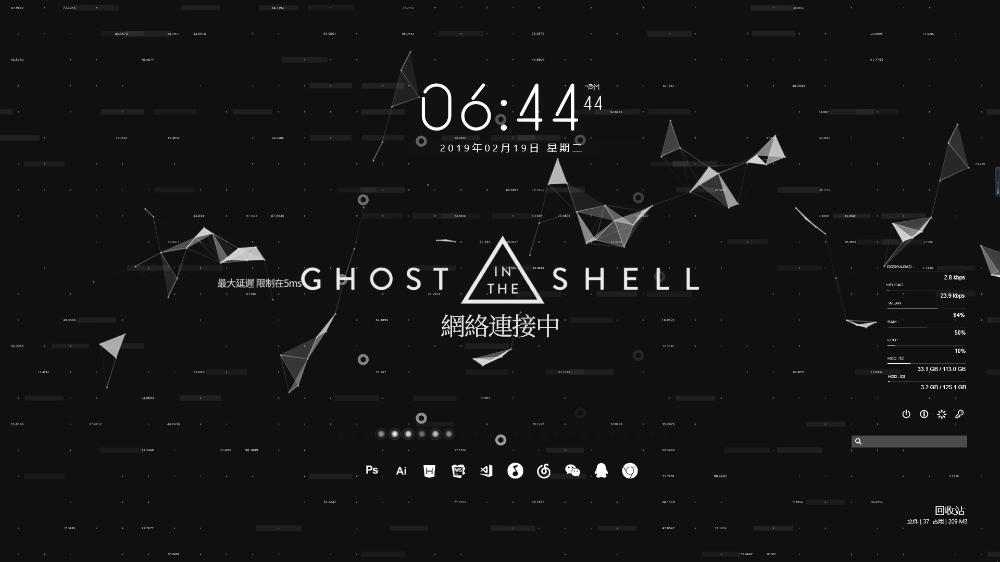

BeipySimple极简主题包
========
Rainmeter软件是轻巧的Win10桌面美化软件，BeipySimple极简主义桌面风格。

因主题不定时更新，所以Beipy不在做安装包，请自行下载BeipySimple文件夹，替换到Rainmeter软件内使用！如不回安装皮肤请自行百度！

主题插件列表：

    Clock：显示当前系统时间
    Power：快捷功能睡眠，关机，重新启动或锁定。
    power buttons：桌面常用状态快捷图标方式。
    Recycle bin：极简文字回收站，单机打开回收站，右击清空回收站。
    Search：桌面百度快捷搜索框，一键搜索，化繁为简。
    Sidebar：贴边隐藏式快捷菜单栏。在1.3版本中废弃，不再使用！
    SysTem：文件夹包含CPU WLAN 下载 上传 RAM 等系统运行状态显示。
    Visualizer：音频跳动装饰。
    默认主题排版辅助线1080（此功能仅支持16:9屏幕）
    排版辅助线 Help 2560
    （包含个人所收藏的几张壁纸）

### 界面欣赏
-----

#### 运行环境
Rainmeter 4.0+

#### 版权

本源码由 [beipy(http://beipy.com)](http://beipy.com) 开发，您可以随意修改、使用、转载。使用或转载时`请务必保留开发版权`！

如发现修改版权的人或单位一单被永久记入本人黑名单！  

**如发现有修改版权的请与本人反馈，在此谢过！📮Email:<beipy0@163.com>**

### 打赏
-----
- **支持项目继续完善下去，你也可以贡献一份力量！💰打赏，更会有更新的动力

### 更新日志
-----
#### 1.3 `2019/02/19`
- **主题中默认采用Win10系统中部分字体文件；**
- 优化主题代码段；
- 新增ICON软件图标；
- 修复主题字体显示异常；
- 修改12h Clock Vertical插件文件字体细节；
- 处理主题系统配置异常问题；
- 删除多余FONT文件；
- 修改Power Buttons插件互动样式动画；

#### 1.2 `2018/12/08`
- 调整界面图标极简图标；
- 新增21:9（2560*1080）的比例尺寸排版辅助线；
- 调整字体样式；

#### 1.0 `2018/11/21`
- 调整排版制作细节；
- 新增默认16：9（1920*1080）屏幕排版辅助线；

